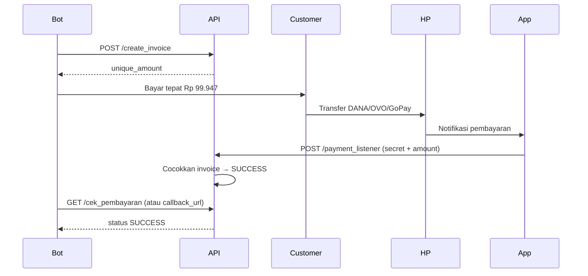

<div align="center">

# ⚡ NotiForwarder

### *Teruskan notifikasi pembayaran ke API — otomatis, real-time, tanpa ribet*

<br/>

[](https://developer.android.com)
[](https://kotlinlang.org)
[](https://m3.material.io)
[](#-integrasi-ke-bot--script)
[](#)

<br/>

```
┌─────────────────────────────────────────────────────────────────┐
│  📱 HP dapat notif DANA/OVO/GoPay  →  App kirim  →  🌐 API kamu  │
└─────────────────────────────────────────────────────────────────┘
```

<br/>

[💬 WhatsApp](https://wa.me/6285888199659) **·** [✈️ Telegram](https://t.me/ar4kiara)

</div>

---

<br/>

## 🎯 Kenapa NotiForwarder?

| | |
|:---:|---|
| 🔔 | **Baca notifikasi** DANA, OVO, GoPay — nominal & sumber terkirim ke API |
| 🔐 | **Secret key** — hanya backend kamu yang bisa terima payload |
| 🎲 | **Kode unik** — minus/plus, range bisa diatur dari bot (no hardcode) |
| ⚡ | **Real-time** — notif masuk → API dapat data dalam hitungan detik |
| 📱 | **Satu app** — pasang di HP, tambah endpoint, nyalakan. Selesai. |

---

<br/>

## 📋 Daftar isi

- [Cara pakai app](#-cara-pakai-app)
- [Integrasi ke bot / script](#-integrasi-ke-bot--script-wa-telegram-dll)
- [API: create_invoice](#1-post-create_invoice--buat-tagihan)
- [API: payment_listener](#2-post-payment_listener--terima-dari-notiforwarder)
- [API: cek_pembayaran](#3-get-cek_pembayaran--cek-status-tagihan)
- [Alur singkat](#-alur-singkat)
- [Kontak](#-kontak)

---

<br/>

## 📲 Cara pakai app

| # | Langkah |
|:---:|---|
| 1 | **Tambah endpoint** → URL: `https://dabis-api.onrender.com/payment_listener`, Secret: `ar4kiara` |
| 2 | **Buka Pengaturan Akses Notifikasi** → aktifkan untuk NotiForwarder |
| 3 | Nyalakan **Teruskan notifikasi ke API** → izinkan notifikasi + baterai/Autostart |
| 4 | Cek **Log aktivitas** untuk pastikan notif terkirim |

> 💡 URL harus lengkap sampai `/payment_listener`. Secret isi **ar4kiara** (sama dengan di backend).

---

<br/>

## 🔌 Integrasi ke bot / script (WA, Telegram, dll.)

Backend kamu cukup sediakan **3 endpoint**:

| Endpoint | Method | Fungsi |
| --- | --- | --- |
| `/create_invoice` | `POST` | Buat tagihan → dapat nominal bayar (`unique_amount`) |
| `/payment_listener` | `POST` | Diterima dari **NotiForwarder** saat ada pembayaran → cocokkan nominal, update lunas |
| `/cek_pembayaran` | `GET` | Cek status tagihan (pending/lunas) dari nominal |

### Config di script bot

```js
global.API_URL = 'https://dabis-api.onrender.com';   // base URL (tanpa /payment_listener)
global.unique_code_min = 1;
global.unique_code_max = 99;
global.unique_code_mode = 'minus';   // minus = bayar lebih sedikit | plus = bayar lebih banyak
```

- **API_URL** → base URL API. Di app isi lengkap: `https://dabis-api.onrender.com/payment_listener`
- **Secret** → isi **ar4kiara** (sama di backend dan di app)

### Kode unik: Minus vs Plus

Sistem bikin **angka acak** (dari `unique_code_min` s/d `unique_code_max`) supaya tiap tagihan punya **nominal unik** (gampang dicocokkan saat pembayaran masuk).

| Mode | Arti | Contoh (harga Rp 100.000, kode 47) |
| --- | --- | --- |
| **minus** | Customer bayar **lebih sedikit** (harga − kode) | Bayar **Rp 99.953** (seperti diskon) |
| **plus** | Customer bayar **lebih banyak** (harga + kode) | Bayar **Rp 100.047** |

Customer harus transfer **tepat** sesuai nominal yang dikasih (`unique_amount`).

---

<br/>

### 1. POST `/create_invoice` — buat tagihan

**Request (body JSON):**

| Field | Wajib | Contoh | Keterangan |
| --- | :---: | --- | --- |
| `order_id` | ✅ | `"INV-001"` | ID pesanan (unik) |
| `amount` | ✅ | `100000` | Harga dasar (angka) |
| `callback_url` | ❌ | `"https://..."` | Dipanggil GET saat lunas (opsional) |
| `unique_code_mode` | ❌ | `"minus"` / `"plus"` | Default `minus` |
| `unique_code_min` | ❌ | `1` | Default 1 |
| `unique_code_max` | ❌ | `99` | Default 99 |

**Response sukses (201):**

```json
{
  "success": true,
  "order_id": "INV-001",
  "unique_amount": 99947,
  "message": "Silakan bayar TEPAT sejumlah 99947"
}
```

**Response gagal (400/500):**

```json
{ "success": false, "message": "order_id dan amount wajib diisi" }
```

```json
{ "success": false, "message": "Gagal membuat kode unik (Tabrakan). Silakan coba lagi." }
```

---

<br/>

### 2. POST `/payment_listener` — terima dari NotiForwarder

Dipanggil **oleh app NotiForwarder** saat ada notifikasi pembayaran.

**Payload dari app (request body):**

```json
{
  "secret": "ar4kiara",
  "amount": 99947,
  "currency": "IDR",
  "source": {
    "package": "id.dana",
    "appName": "DANA",
    "patternName": "Dana sukses",
    "patternRegex": "Kamu berhasil menerima Rp[\\d\\.,]+"
  },
  "notification": {
    "title": "Kamu berhasil menerima",
    "text": "Kamu berhasil menerima Rp99.947 dari ...",
    "timestamp": 1732176000000
  },
  "device": { "manufacturer": "Xiaomi", "model": "...", "sdk": 35 }
}
```

**Wajib dipakai:** `secret` (validasi) dan `amount` (nominal). Sisanya opsional.

**Response sukses (200):**

```json
{
  "success": true,
  "message": "Pembayaran 99947 berhasil dicocokkan."
}
```

**Response gagal:**

| Kode | Kondisi | Body |
| :---: | --- | --- |
| 403 | Secret salah | `{ "success": false, "message": "Invalid Secret Key" }` |
| 400 | Amount tidak valid | `{ "success": false, "message": "Amount tidak valid" }` |
| 404 | Tidak ada invoice | `{ "success": false, "message": "Tidak ada invoice PENDING untuk jumlah 99947" }` |

---

<br/>

### 3. GET `/cek_pembayaran` — cek status tagihan

**Request:** `GET /cek_pembayaran?unique_amount=99947`

**Response sukses (200):**

```json
{
  "success": true,
  "status": "SUCCESS",
  "order_id": "INV-001",
  "unique_amount": 99947
}
```

`status` bisa `PENDING` atau `SUCCESS`.

**Response gagal (404):**

```json
{
  "success": false,
  "status": "NOT_FOUND",
  "message": "Invoice untuk jumlah tersebut tidak ditemukan"
}
```

---

<br/>

## 🔄 Alur singkat



**Versi singkat:**

```
1. Bot panggil create_invoice  →  dapat unique_amount  →  kasih ke customer (bayar tepat segitu)
2. Customer bayar  →  notif di HP  →  NotiForwarder kirim ke payment_listener (secret + amount)
3. Backend cocokkan amount dengan invoice  →  update SUCCESS
4. Bot cek_pembayaran (polling) atau tunggu callback_url
```

---

<br/>

## 📞 Kontak

| | |
| --- | --- |
| **WhatsApp** | [6285888199659](https://wa.me/6285888199659) |
| **Telegram** | [@ar4kiara](https://t.me/ar4kiara) |

---

<div align="center">

**NotiForwarder** — *Teruskan notif pembayaran ke API.*

</div>
